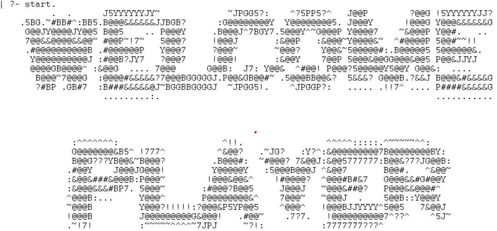
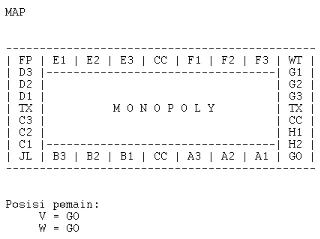
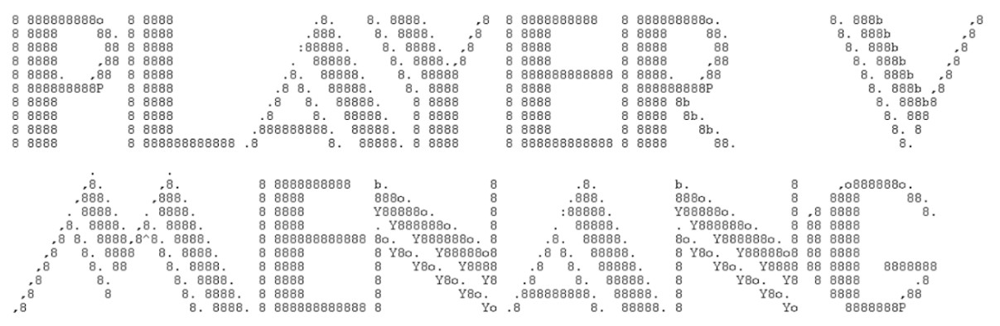

[](https://classroom.github.com/online_ide?assignment_repo_id=9300794&assignment_repo_type=AssignmentRepo)
# Tugas-Besar-Logika-Komputasional-2022

# Kelompok AyoDapetKaya!!
| Nama | NIM |
| ----------- | ----------- |
| Kelvin Rayhan Alkarim | 13521005 |
| Ditra Rizqa Amadia | 13521019 |
| Bernardus Willson | 13521021 |
| Raditya Naufal Abiyu | 13521022 |
| Kartini Copa | 13521026 |

## Table of Contents
* [Permainan Monopoly](#deskripsi-umum)
* [Strutur](#struktur)
* [Tampilan](#tampilan)
* [Fitur](#fitur)
* [Requirement](#requirement)
* [Versi GNU Prolog](#GNUversion)
* [Cara Menjalankan Program](#cara-menjalankan-program)


# Permainan Monopoly
> Membuat permainan papan Monopoly dengan menggunakan bahasa pemrograman deklaratif Prolog (GNU Prolog). Permainan Monopoly ini dibuat dengan mengimplementasikan materi-materi yang telah dipelajari pada kuliah IF2121 Logika Komputasional. Terdapat pengimplementasian materi Rekurens, List, Cut, Fail, dan Loop. 


# Struktur
```bash
.
│   README.md
│
├───doc                             # Laporan
│   ├───Laporan_J03.pdf
|   ├───Milestone 1 Kelompok Ayo Dapat Kaya!!.txt
|   ├───Milestone 2 Kelompok Ayo Dapat Kaya!!.txt
|   ├───bin
│   │       start.jpg
|   |       map.jpg
│   │       win.jpg
|   |
├───src                             # Source code
│   ├───APP                
│   │       bankruptApp.pl
│   │       buyProperty.pl
│   │       chanceCardApp.pl
│   │       help.pl
│   │       locDetailApp.pl
│   │       main.pl
│   │
│   │       
└───Data                      
            card.pl
            dice.pl
            location.pl
            player.pl
   
```

# Tampilan
## Tampilan Awal


## Tampilan Papan Monopoly


## Tampilan Pemain Menang


## Fitur
| Fitur | Deskripsi |
| ----------- | ----------- |
| start | Memulai permainan |
| map | Informasi papan Monopoly |
| help | Informasi Command |
| locDetail | Informasi lokasi |
| playerdetail | Informasi pemain |
| propDetail | Informasi properti |
| payRent | Pembayaran sewa |
| buyProperty | Pembelian properti |
| payTax | Pembayaran pajak |
| sellProperty | Menjual properti |
| chanceCard | Kartu Tax, Kartu Hadiah, Karto Go To Jail, Kartu Out From Jail |
| bankrupt | Menunjukkan pemain bangkrut |
| worldTour | Pergi kemana saja |

## Requirement
Download compiler GNU Prolog dan pastikan bisa dijalankan.

# Versi GNU Prolog
GNU Prolog 1.5.0 (64 bits)
Compiled Jul 8 2021, 12:22:53 with gcc
By Daniel Diaz
Copyright (C) 1999-2021 Daniel Diaz

# Cara Menjalankan Program
1. Consult file main.pl di GNU Prolog
2. Selanjutnya jalankan Command 'start', untuk memulai permainan.
3. Setelah Homepage dari game muncul, permainan dapat dimulai.
4. Jalankan Command 'help'. Help akan memberikan informasi tentang command yang dapat dijalankan.
